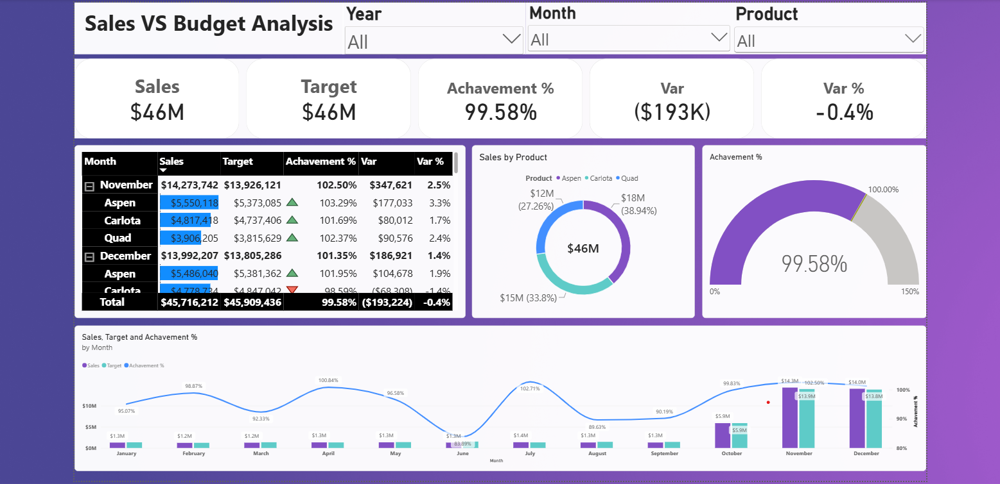

# sales-vs-budget-analysis
Power BI dashboard analyzing sales performance against budget, achievement, variance, and monthly trends.

## Project Overview

This project focuses on analyzing sales performance and profitability using Power BI.

The dataset was cleaned and transformed using Power Query, then analyzed and visualized through an interactive Power BI dashboard.

The dashboard provides insights into sales, profit, regions, categories, and other key business metrics using interactive charts, slicers, and KPIs.

## 🛠️ Tools & Technologies

- Power BI
- Power Query
- DAX
- Data Cleaning & Transformation
- Data Visualization
- KPI Analysis

  ## 📈 Analysis

The dashboard focuses on the following key areas:

- Actual Sales vs Budget
- Sales Achievement %
- Sales Variance
- Profitability Analysis
- Monthly Sales Trends
- Regional Performance
- Category Performance
- Key Business KPIs

## 📊 Dashboard Preview

## 💡 Key Insights

- Total sales reached approximately $45.7M against a target of $45.9M.
- Overall sales achievement was 99.58%, slightly below the target.
- The total sales variance was approximately -$193K (-0.4%).
- November achieved 102.50% of its target, exceeding the monthly target.
- December achieved 101.35% of its target, also exceeding the monthly target.
  
## 🎯 Project Objective

The objective of this project is to transform raw sales data into meaningful business insights and an interactive dashboard to support data-driven decision making.

## 🧠 Skills Demonstrated

- Data Cleaning & Transformation
- Data Analysis
- DAX
- KPI Development
- Data Visualization
- Business Performance Analysis
